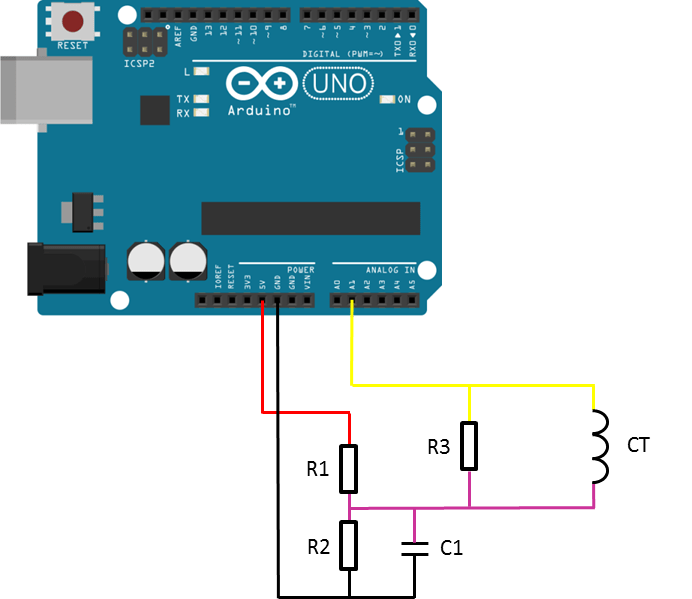

# Current Transformer

Process current measurement out of current transformers

Current transformer are really suitable for measuring AC current in a none 
invasive way.

## Getting started

Clone the repository into your libraries folder; or download it and unzip in 
the `Arduino/libraries` folder.

> git clone https://github.com/azinke/current-transformer.git

## Wiring

<div style="text-align:center">
    
</div>

- *R3*: shunt resistor (should checkout the datasheet of your sensor to get the 
      right value
- *R1, R2*: 10k
- *C1*: 100µF

## Methods

```c++
    // constructor
    CT(uint16_t turns, uint16_t shunt, uint8_t calibre, uint8_t pin);
    /**
        turns: the number of turn (coil) on the secondary of the transformer
        shunt: the value of the shunt resistor used on the secondary
        calibre: the max current the sensor is able to measure
        pin: the analog input the output of the sensor is connected to
    **/
```

```c++
    float calibrate();
    /**
        get the offset value of the sensor

        *Note:* The calibration should be done while the sensor is not under 
                load
    **/
```

```c++
    float getRawData();
    /**
        read raw data from the sensor. Raw data is meaningless
    **/ 
```

```c++
    float read(uint8_t unit);
    /**
        read a single measurement
        
        unit:
                (predefined constants)
            mA : read the current in milliampere
            A  : read the current in ampere
            MAX: read the max value of the current
            MIN: read the min value of the current
    **/
```

```c++
    float getMax(uint8_t unit);
    /**
        read the max value of the current

        unit: 
                (predefined constants)
            mA: read max value in ampere
            default unit: Ampere
    **/
```

```c++
    float getMin(uint8_t unit);
    /**
        read the min value of the current

        unit: 
                (predefined constants)
            mA: read max value in ampere
            default unit: Ampere
    **/
```

```c++
    float getOffset();
    /**
        read the offset value of the sensor
    **/
```
### Examples

Checkout the `examples` folder to have a sample of code


